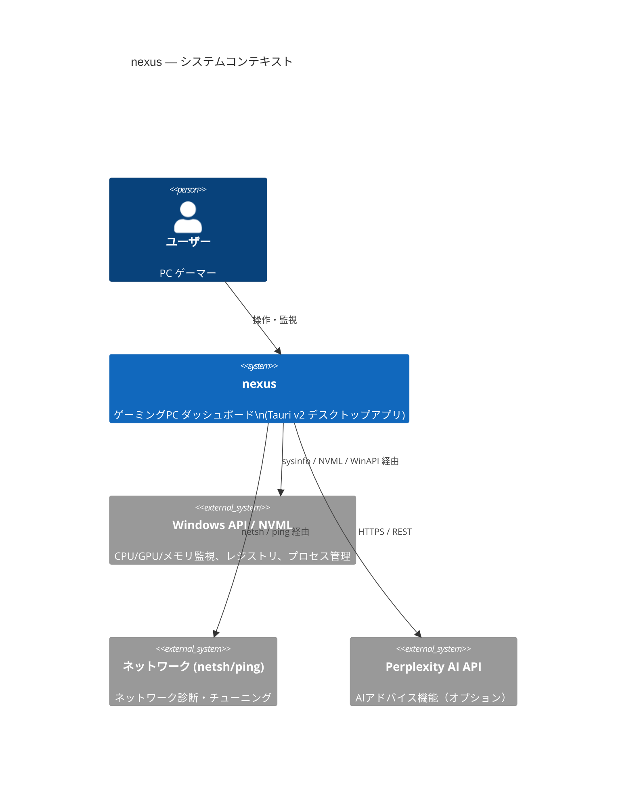
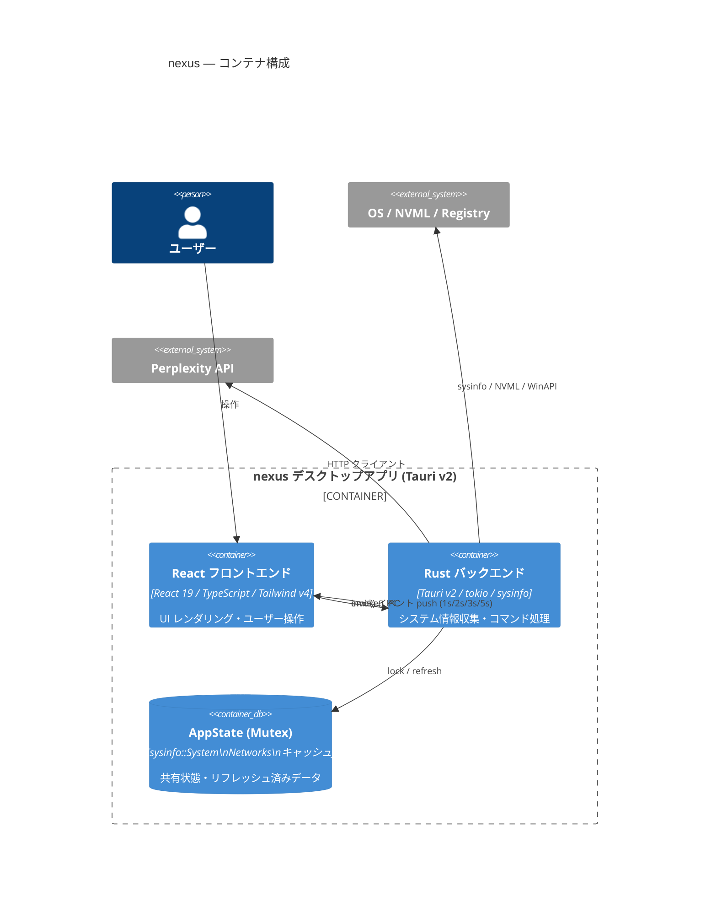

# nexus アーキテクチャドキュメント

**更新日**: 2026-04-03  
**バージョン**: v2.x (Tauri v2 + React 19)

---

## 概要

nexus はゲーミングPC のリアルタイムハードウェア監視・パフォーマンス最適化ダッシュボード。
Tauri v2 の IPC を通じて、Rust バックエンドがシステム情報を収集してフロントエンドに push する。

---

## C4 コンテキスト図



---

## C4 コンテナ図



---

## フロントエンド構成

```
src/
├── App.tsx                  # Wing ルーティング + visitedWings ロジック
├── main.tsx                 # エントリポイント
├── components/
│   ├── layout/
│   │   └── Shell.tsx        # サイドバー + Wing マウント
│   ├── views/               # 各 Wing の最上位コンポーネント
│   │   ├── CoreWing.tsx     # CPU / GPU / メモリ監視
│   │   ├── ArsenalWing.tsx  # プロセス管理 (Ops)
│   │   ├── TacticsWing.tsx  # 最適化コントロール
│   │   ├── LogsWing.tsx     # システムログ・診断
│   │   └── SettingsWing.tsx # 設定
│   ├── panels/              # Wing 内の再利用パネル
│   ├── system/              # KpiGrid, SpecBar 等の共通 UI
│   ├── optimize/            # 最適化 UI コンポーネント
│   └── ui/                  # 汎用 UI コンポーネント
├── stores/                  # Zustand v5 ストア（11個）
│   ├── useHardwareStore.ts  # GPU/CPU 静的情報
│   ├── useSystemStore.ts    # sysinfo リアルタイムデータ
│   ├── useOptimizeStore.ts  # 最適化設定・状態
│   ├── useNavStore.ts       # ナビゲーション状態
│   ├── useUiStore.ts        # UI 状態（モーダル等）
│   └── ...                  # その他 8 ストア
├── lib/
│   └── tauri.ts             # extractErrorMessage 等の IPC ユーティリティ
└── types/
    └── index.ts             # WingId, assertNever 等の共通型
```

---

## バックエンド構成（4層アーキテクチャ）

```
src-tauri/src/
├── lib.rs                   # Tauri ビルダー + invoke_handler 登録
├── main.rs                  # エントリポイント
├── state.rs                 # AppState 定義（sysinfo::System / Networks / キャッシュ）
├── error.rs                 # AppError enum (thiserror + serde)
├── constants.rs             # 定数（保護プロセス名等）
│
├── commands/                # [Layer 1] IPC エンドポイント（薄いグルー層）
│   ├── pulse.rs             # ResourceSnapshot（CPU/メモリ/ネット）
│   ├── hardware/            # GPU/CPU 静的情報
│   ├── ops.rs               # プロセス一覧
│   ├── boost.rs             # パフォーマンスブースト
│   ├── optimize/            # 最適化操作群
│   ├── memory.rs            # メモリクリーナー
│   └── ...
│
├── services/                # [Layer 2] ビジネスロジック
│   ├── hardware.rs          # GPU 動的/静的情報取得（NVML ラッパー）
│   ├── optimize/            # 最適化アルゴリズム
│   ├── game_monitor.rs      # ゲーム検出
│   ├── thermal_monitor.rs   # サーマルアラート
│   ├── network_monitor/     # ネットワーク監視
│   └── ...
│
├── infra/                   # [Layer 3] OS/ハードウェア抽象化
│   ├── gpu.rs               # NVML 直接アクセス
│   ├── registry.rs          # Windows レジストリ操作
│   ├── powershell.rs        # PowerShell 実行ヘルパー
│   ├── process_control/     # プロセス管理
│   ├── power_plan/          # 電力プラン管理
│   └── ...
│
└── emitters/                # [Layer 4] イベント push（push 型 IPC）
    └── unified_emitter/
        ├── emitter_loop.rs  # メインループ（1s サイクル）
        ├── hardware_collector.rs
        └── thermal.rs
```

---

## イベント push スケジュール

| イベント名 | 間隔 | 内容 |
|-----------|------|------|
| `nexus://pulse` | 2秒 | CPU% / メモリ / ネット / GPU 使用率（キャッシュ） |
| `nexus://ops` | 3秒 | プロセス一覧（CPU使用率順 Top100） |
| `nexus://hardware` | 5秒 | CPU名 / GPU名 / VRAMサイズ / ディスク / ブート時刻 |
| GPU キャッシュ更新 | 3秒 | NVML から GPU 使用率/温度/VRAM を取得しキャッシュ |

---

## Zustand ストア一覧

| ストア | 購読イベント | 役割 |
|--------|------------|------|
| useSystemStore | nexus://pulse | CPU/メモリ/ネットのリアルタイム数値 |
| useHardwareStore | nexus://hardware | GPU/CPU の静的スペック情報 |
| useOptimizeStore | — | 最適化アイテムの状態管理 |
| useNavStore | — | 現在の Wing ID |
| useUiStore | — | モーダル・ドロワー表示状態 |
| useSettingsStore | — | ユーザー設定 |
| useAppSettingsStore | — | アプリ設定（永続化） |
| useMemoryStore | — | メモリクリーナー状態 |
| useNetworkStore | — | ネットワーク診断状態 |
| useTimerStore | — | タイマー機能 |
| useWindowsStore | — | Windows 設定 |

---

## デザインシステム

- **コンセプト**: 漆黒の中にシアンの光が浮かぶ航空計器
- **メインカラー**: `#06B6D4`（シアン単色、オレンジなし）
- **フォント**: B612 / B612 Mono
- **CSS トークン**: `src/globals.css` の `:root` に定義（Tailwind v4 `@theme`）
- **詳細仕様**: `DESIGN.md` v2 (Part 1-8)

---

## 重要な制約・決定事項

| 制約 | 理由 |
|------|------|
| ファイル 300 行以下 | AI コンテキスト効率・レビュー可読性 |
| `System::new_all()` コマンド内禁止 | パフォーマンス（AppState を共有） |
| GPU 更新 3 秒間隔 | NVML の過負荷防止 |
| `mountedWings` 廃止 → `visitedWings` | 一度訪問した Wing の DOM を保持（再マウントコスト削減） |
| エラー型 `AppError` 統一 | フロント側の型安全なエラー処理 |
| `#[cfg(windows)]` ガード必須 | Linux CI 対応 |

---

## 参考ドキュメント

- [DESIGN.md](../DESIGN.md) — デザインシステム仕様
- [docs/BACKEND.md](BACKEND.md) — バックエンド詳細設計
- [docs/TESTING.md](TESTING.md) — テスト戦略
- [.claude/rules/tauri-v2-gotchas.md](../.claude/rules/tauri-v2-gotchas.md) — Tauri v2 注意点
- [~/.claude/rules/tauri-v2-gotchas.md] — 全プロジェクト共通 Tauri 知識
